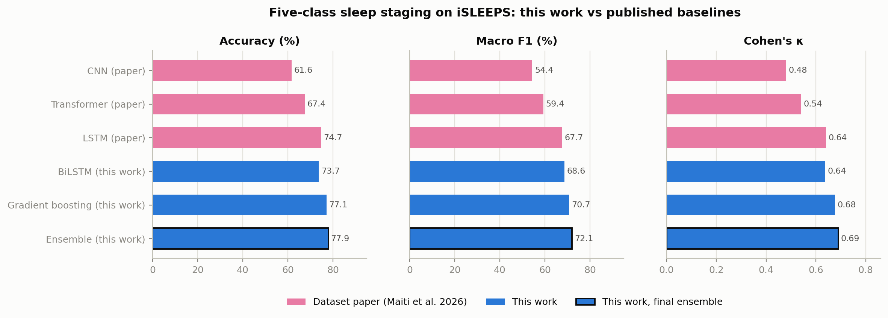
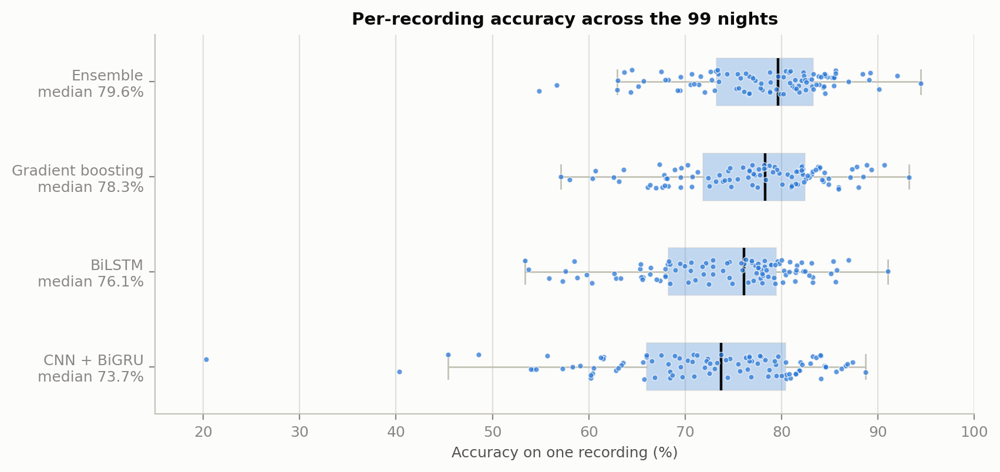
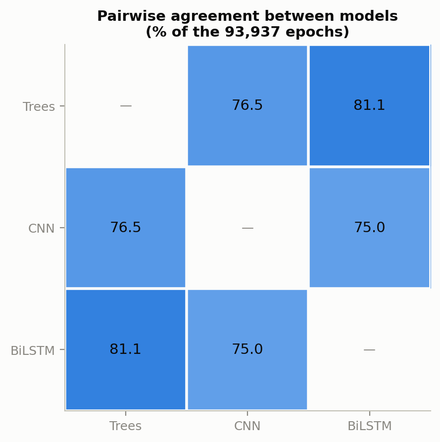
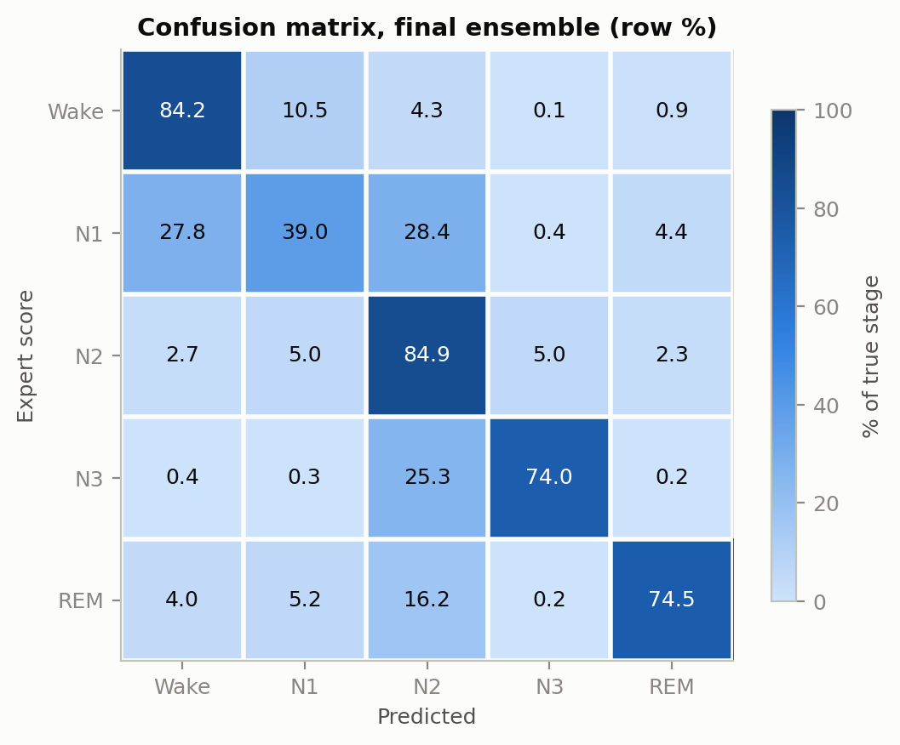
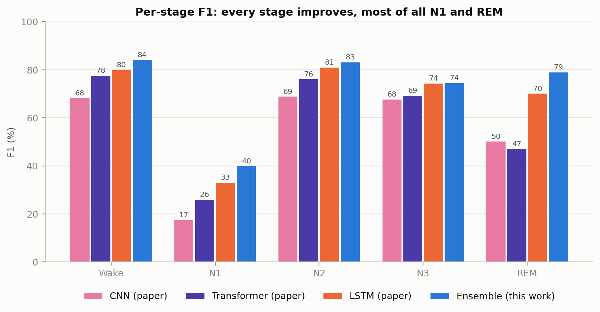
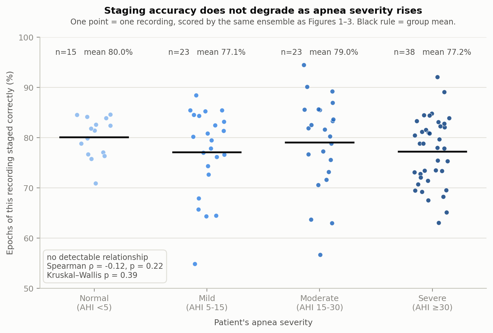
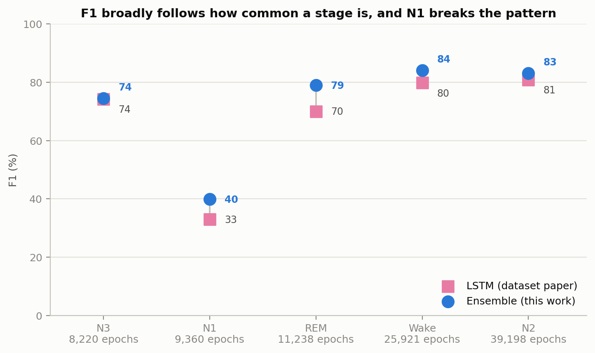
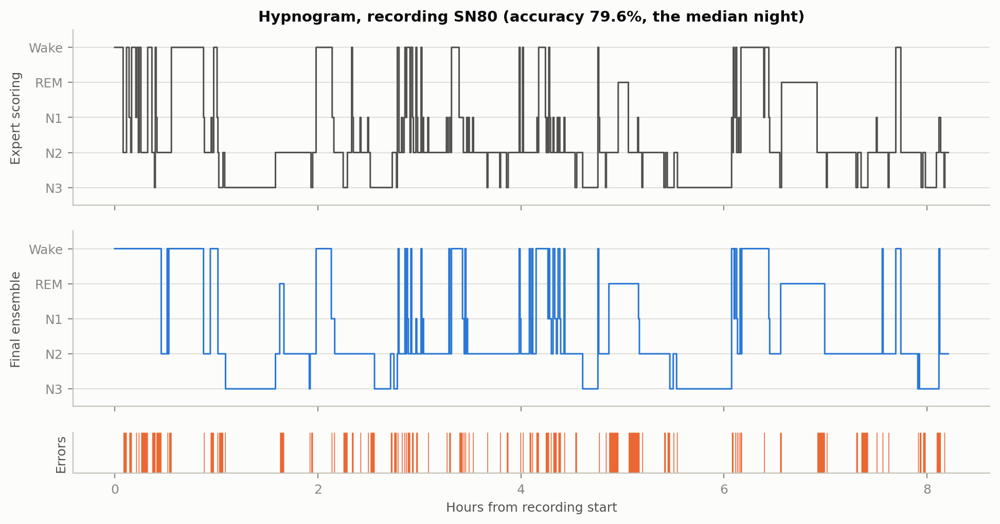

# Automated sleep staging on the iSLEEPS stroke cohort

### Development report

---

## 1. Summary

I built an automated five-class sleep stage classifier (Wake, N1, N2, N3, REM)
for the iSLEEPS dataset, which contains 100 overnight polysomnography recordings
from ischemic stroke patients at NIMHANS. The final system is an ensemble of
three models: gradient-boosted trees over engineered spectral features, a
convolutional network with a bidirectional GRU over raw signal, and a
bidirectional LSTM over the feature sequence.

Evaluated with five-fold cross-validation grouped by patient across 93,937
scored epochs, it reaches **77.94% accuracy, 0.7210 macro F1, and Cohen's
κ = 0.690**.

The dataset paper (Maiti et al., *Scientific Data* 13:421, 2026) reports
baselines on the same data using single-channel EEG or EOG. Its strongest model
was an LSTM at 74.70% accuracy, 67.68 macro F1, κ = 0.64, followed by a
Transformer at 67.44% and a CNN at 61.65%. The ensemble described here is ahead
of the best of those on every overall metric and on every individual sleep
stage, with the largest gains on REM and N1.



*Figure 1. Accuracy, macro F1 and Cohen's κ for the three baselines published
with the dataset and the three models built here. Three panels rather than one,
because κ is a 0–1 agreement statistic and placing it on a percentage axis would
misrepresent the comparison. The ringed bar is the final system.*

The rest of this report covers how the data was prepared, what models I tried
and why, what the results were, and what did not work. Sections 6 and 7 record
the negative results and the engineering problems encountered along the way,
several of which changed how I approached the modelling.

---

## 2. Data preparation

### 2.1 Signals and channel selection

The recordings use two different naming conventions for the same electrode
derivations. 64 recordings label channels against the M1 and M2 mastoid
references (`C4:M1`, `E1:M2`), while 36 use the older A1 and A2 nomenclature
(`C4:A1`, `EOG1:A2`). Table 1 of the dataset paper documents both forms. The
practical consequence is that no EEG channel is present in all 100 recordings
under a single label, so channel selection by exact string match quietly drops
36% of the cohort. I normalise both conventions to a canonical name before
anything else happens.

After normalisation, seven channels are available in every recording: four EEG
(C3, C4, O1, O2), two EOG (E1, E2), and chin EMG. The frontal channels F3 and F4
appear in only 87 recordings and are excluded, a decision I revisit in section 8.

Everything is resampled to 100 Hz, matching the paper's own preprocessing. EEG
and EOG are band-passed 0.3–35 Hz. The EMG is filtered 10–45 Hz instead, since
its useful content is high-frequency muscle tone and its low-frequency content
is mostly movement artefact.

### 2.2 Labels and epoch alignment

Sleep stages come from the per-recording annotation workbooks at 30-second
resolution. Two properties of these files needed handling.

The hypnogram is not aligned to the start of the recording. It generally begins
a few seconds earlier, and both the annotation timestamps and the EDF start time
are wall-clock times of day on recordings that cross midnight. Rather than
assuming a shared origin, I place each epoch using its own timestamp with a
day-wrap correction, then keep only epochs that fall entirely inside the
recording.

The hypnogram is also not always on the first worksheet. In most recordings
sheet 1 holds the sleep profile, but in at least one (SN80) it holds the ambient
light sensor in lux, with the sleep stage in a separate column. Parsing sheet 1
positionally produces illuminance readings where stage labels should be. The
parser therefore scans every sheet and every column and keeps whichever column
actually contains stage names.

After alignment and after dropping epochs labelled Artefact, Movement or
unscored, the usable dataset is 93,937 epochs. The class distribution is heavily
imbalanced, consistent with the distribution reported in the paper:

| stage | epochs | share |
|---|---|---|
| N2 | 39,198 | 41.7% |
| Wake | 25,921 | 27.6% |
| REM | 11,238 | 12.0% |
| N1 | 9,360 | 10.0% |
| N3 | 8,220 | 8.8% |

### 2.3 Defining the cross-validation unit

The dataset paper splits its data patient-wise, assigning all epochs from a
given patient to exactly one of train, validation or test. That is the right
principle and I follow it.

The implementation detail that matters is what counts as a patient. The
recordings are named SN1 through SN100, but they do not correspond to 100
distinct individuals. Grouping the clinical metadata on all 63 columns produces
twelve groups covering 26 recording IDs, each group sharing age, sex,
occupation, diagnosis, laboratory values and AHI exactly. In one case the
duplication is unambiguous: SN15 and SN28 contain byte-identical signal data,
differing only in the eight bytes of the EDF patient identifier field, and
identical hypnograms across all 880 epochs. I exclude SN15 and treat the
remaining groups as single patients, leaving 99 recordings from 86 patients.

This is not a cosmetic distinction. Measured directly on the feature cache, a
split keyed on recording ID places the same patient on both sides of the
train/test boundary in five out of five folds. A split keyed on patient does so
in zero. All results below use patient grouping. The script accepts
`--group-by recording` as a diagnostic for quantifying the difference, but it is
not a reporting mode.

---

## 3. Feature representation

Each 30-second epoch is described by 106 base features, chosen to correspond to
the properties the AASM scoring rules actually reference.

For each EEG channel: relative power in the delta, theta, alpha, sigma and beta
bands, log total power, five log band ratios, a slow-to-fast ratio, spectral
entropy, the 95% spectral edge frequency, Hjorth mobility and complexity, and
robust time-domain moments. For each EOG channel: band-limited slow and fast
power plus the same time-domain statistics. I also compute the correlation
between E1 and E2, which becomes strongly negative during REM because rapid eye
movements deflect the two electrodes in opposite directions. For the EMG: log
RMS and a high-to-low band ratio, which together act as an atonia detector.

Three transformations are then applied per recording. Robust z-scoring on the
median and interquartile range removes between-subject and between-amplifier
amplitude differences that would otherwise dominate the tree splits. Centred
rolling means over ±2 and ±7 epochs supply local context, on the reasoning that
a single 30-second epoch is often ambiguous and human scorers also look at
neighbouring epochs. Finally, two positional features encode where in the night
the epoch falls, since N3 concentrates early and REM late.

The result is 426 features per epoch. The context transforms turned out to
matter more than I expected, which section 6.3 returns to.

---

## 4. Models

### 4.1 Gradient-boosted trees

I chose boosted trees over engineered features as the primary model for four
reasons.

The scoring criteria are already known and are spectral. AASM rules are defined
in terms of band power and a small number of waveform properties: delta activity
for N3, sigma spindles for N2, chin atonia with conjugate eye movement for REM,
alpha dropout at the Wake/N1 boundary. A feature encoding relative sigma power
begins close to the answer, whereas a network operating on raw signal must
first rediscover a spectral decomposition from 3,000 samples per epoch.

The cohort is small. 86 patients is well below the scale at which deep sleep
staging models are usually trained.

Trees are cheap, which allowed more experiments in the same time budget.

The cohort is also pathological. Stroke patients show focal slowing and
asymmetry, and feature importances let me see which channels and bands the model
relies on, which a network does not.

I did not pursue linear models or SVMs, because the relevant decision boundaries
are strongly interacting (REM requires low EMG *and* eye movement *and* mixed
frequency content), and a linear model would need those interactions constructed
by hand. Random forests were skipped as generally dominated by boosting on
tabular biosignal features.

### 4.2 CNN with bidirectional GRU

For comparison I implemented a network on the raw signal, following the
DeepSleepNet design. Two parallel convolutional branches process each epoch: one
with a 0.5-second kernel to resolve transient graphoelements such as spindles
and K-complexes, one with a 4-second kernel for slow rhythms. A single kernel
size handles one or the other, not both. The per-epoch embeddings then pass
through a bidirectional GRU over 20 consecutive epochs, since sleep stages
persist for minutes and the AASM rules are explicitly contextual. Bidirectional
processing is legitimate here because whole nights are scored offline.

### 4.3 Bidirectional LSTM over features

The paper's strongest baseline was an LSTM, so I tried the same architectural
idea on the engineered features rather than on signals: a projection to 256
units, a two-layer BiLSTM, and a per-epoch classification head, over windows of
100 epochs. Feature standardisation uses statistics computed on training
recordings only.

The intent was to combine the two things that had each worked in isolation,
domain features for what an epoch looks like and a recurrent model for how a
night is structured. At 426 numbers per epoch rather than seven channels of
3,000 samples, sequences are cheap enough to give the model roughly 50 minutes
of context, against the CNN's ten.

### 4.4 Ensembling and sequence decoding

The three models are combined by averaging their posterior distributions with
equal weight. Equal weighting requires no tuning and cannot overfit a held-out
set, which matters at this cohort size.

I also implemented Viterbi decoding over the posteriors. Sleep is a strongly
self-transitioning process; measured on this data, the probability of remaining
in the same stage is 0.908 for Wake, 0.711 for N1, 0.930 for N2, 0.913 for N3
and 0.952 for REM. Decoding the most likely sequence rather than the most likely
epoch should in principle correct isolated misclassifications inside long stable
runs. The transition matrix is estimated from training recordings only, and the
weight on the transition term is selected per fold using the training
recordings' out-of-fold posteriors, so the test fold is untouched.

---

## 5. Results

Every figure in this report is regenerated by `python submission\make_figures.py`
and reads only from the saved fold posteriors, so no number in a figure can drift
from the numbers in the text.

All figures are out-of-fold, five-fold cross-validation grouped by patient, over
93,937 epochs.

### 5.1 Individual models

| model | accuracy | macro F1 | κ |
|---|---|---|---|
| Gradient boosting (400 trees) | 0.7712 | 0.7070 | 0.6768 |
| BiLSTM over features | 0.7373 | 0.6863 | 0.6371 |
| CNN + BiGRU | 0.7219 | 0.6602 | 0.6144 |

The ordering is informative. Both sequence models that receive engineered
features outperform the convolutional model that has to learn its own
representation, and the BiLSTM achieves this while training in about three
seconds per fold against several minutes for the CNN. This is consistent with
the expectation in section 4.1 that at this cohort size, supplying a good
representation is worth more than learning one.

Gradient boosting beats the CNN by a clear margin. Testing on the recording
rather than the epoch, since epochs within a night are heavily correlated, the
tree model is better on 74 of 99 recordings, mean difference in accuracy +0.052,
Wilcoxon signed-rank p = 2.4 × 10⁻⁷.

One prediction of mine did not hold. I expected the BiGRU to beat the trees
specifically on stage persistence. It did reduce N3-to-N2 leakage from 28.1% to
20.4%, but N3 precision fell from 0.751 to 0.651 and REM performance worsened
overall. The network is less biased toward the majority class rather than better
at modelling persistence, trading precision for recall on the rare stages.

Averages hide how much these models vary from night to night, which is what a
clinician would actually encounter. Accuracy on an individual recording ranges
from roughly 55% to 95%, and the CNN has a longer bad tail than either of the
others.



*Figure 2. Distribution of accuracy across the 99 recordings, one point per
night. Box shows the interquartile range, black rule the median.*

### 5.2 Ensemble

| variant | accuracy | macro F1 | κ |
|---|---|---|---|
| trees + CNN, with Viterbi | 0.7805 | 0.7125 | 0.6893 |
| **trees + CNN + BiLSTM** | 0.7794 | **0.7210** | **0.6902** |

The two are statistically indistinguishable on accuracy. Paired across the 99
recordings, the three-model ensemble wins on 46, mean difference −0.0009,
Wilcoxon p = 0.53, and the κ difference of +0.0009 is within noise. What the
third member does buy is per-stage balance: N1 F1 rises from 0.372 to 0.399, N3
from 0.735 to 0.744 and REM from 0.780 to 0.789, against a small loss on Wake
from 0.846 to 0.841. Since N1 and N3 both carry clinical meaning, I take the
three-model ensemble as the final system, but a submission judged on raw
accuracy alone would reasonably prefer the two-model version.

Two observations. Viterbi decoding becomes a no-op once the LSTM is included:
accuracy is unchanged to four decimal places, and the per-fold weight selection
chooses zero smoothing. The recurrent model is already supplying what the
transition matrix provided. Separately, the oracle bound (the accuracy achievable
if some perfect arbiter always picked whichever model was right) rises from
0.8464 with two models to 0.8756 with three, while equal-weight averaging
captures very little of that increase. The remaining headroom lies in a better
combiner rather than a fourth model.



*Figure 3. How often each pair of models assigns the same stage to the same
epoch. Agreement in the mid-to-high seventies is the precondition for the
ensemble helping at all: averaging models that agreed everywhere would gain
nothing.*

Final per-stage performance:

| stage | precision | recall | F1 | support |
|---|---|---|---|---|
| Wake | 0.841 | 0.842 | 0.841 | 25,921 |
| N1 | 0.408 | 0.390 | 0.399 | 9,360 |
| N2 | 0.813 | 0.849 | 0.831 | 39,198 |
| N3 | 0.749 | 0.740 | 0.744 | 8,220 |
| REM | 0.840 | 0.745 | 0.789 | 11,238 |



*Figure 4. Row-normalised confusion matrix for the final ensemble. The two
structural error modes are visible as the off-diagonal blocks: a quarter of N3
and a sixth of REM are called N2, and N1 is split almost evenly three ways.*

### 5.3 Comparison with the published baselines

Table 3 of the dataset paper reports five-class staging on iSLEEPS using
single-channel EEG or EOG with 10-fold cross-validation.

| model | ACC | MF1 | κ | W | N1 | N2 | N3 | REM |
|---|---|---|---|---|---|---|---|---|
| CNN (paper, EEG) | 61.65 | 54.44 | 0.48 | 68.15 | 17.43 | 68.82 | 67.65 | 50.12 |
| Transformer (paper, EEG) | 67.44 | 59.35 | 0.54 | 77.53 | 25.91 | 76.07 | 69.18 | 47.03 |
| LSTM (paper, EEG) | 74.70 | 67.68 | 0.64 | 79.87 | 32.99 | 80.91 | 74.25 | 70.04 |
| BiLSTM on features (this work) | 73.73 | 68.63 | 0.637 | 80.2 | 37.2 | 79.8 | 71.6 | 74.3 |
| Gradient boosting (this work) | 77.12 | 70.70 | 0.677 | 83.5 | 37.0 | 82.0 | 73.1 | 77.9 |
| **Ensemble (this work)** | **77.94** | **72.10** | **0.690** | **84.1** | **39.9** | **83.1** | **74.4** | **78.9** |

The ensemble is ahead of the best published baseline on all three overall
metrics and on all five stages. The largest margins are on REM (+8.9 F1) and N1
(+6.9), which are the two stages the published models handled least well.

My BiLSTM is a reasonable point of comparison against the paper's LSTM, since
the architectures are close. Its accuracy is slightly lower (73.73 against
74.70) but its macro F1 is higher (68.63 against 67.68) and κ is effectively
tied. Given that my folds are grouped by patient rather than by recording ID
(section 2.3), I read this as reproducing their result rather than falling short
of it.

The most likely explanation for the ensemble's margin over the published
baselines is input: the paper's models use a single EEG or EOG channel, while
this work uses seven channels summarised into features designed around the
scoring criteria.



*Figure 5. Per-stage F1 for the three published baselines and the final
ensemble. The overall metrics compress the fact that the gains are concentrated
in N1 and REM, the two stages the published models handled least well.*

### 5.4 Does accuracy depend on the patient?

Around 85% of these patients
have sleep-disordered breathing, and apnea fragments sleep with frequent
arousals, so it is reasonable to worry that a model validated on this dataset
performs worse for exactly the patients it is most likely to be used on. To
check, I took the same ensemble predictions reported above, computed the share
of correctly staged epochs for each of the 99 recordings separately, and grouped
those 99 values by the patient's apnea severity from the AHI column of the
clinical metadata. No new model and no new predictions are involved.

There is no detectable relationship. Mean accuracy is 80.0% for the 15 normal
recordings, 77.1% for mild, 79.0% for moderate and 77.2% for the 38 severe
cases; across all 99 recordings the rank correlation between AHI and accuracy is
ρ = −0.12 (p = 0.22), and a Kruskal-Wallis test across the four severity classes
gives p = 0.39. Whatever makes a night hard for this model, it is not the
patient's AHI.



*Figure 6. Staging accuracy for each recording, grouped by the patient's apnea
severity. These are the same ensemble predictions reported above, aggregated per
recording; no separate model was trained. The group means differ by less than
three points and the spread within each group dwarfs the differences between
them.*

### 5.5 Where the system still fails

Two error modes dominate.

N1 remains weak at 0.399 F1, with 27.8% of true N1 called Wake and 28.4% called
N2. N1 is the stage human scorers agree on least, with published inter-rater κ
frequently below 0.5, so a model trained on single-scorer labels has limited
headroom here. It is worth noting that 0.399 is already well above the 0.330
reported for the paper's best model.

Rarity alone does not explain it. N3 is the *least* common stage in the dataset
and scores 0.744; N1 is more common and scores barely half that. Whatever makes
N1 hard is intrinsic to the stage rather than a consequence of how much of it
there is to learn from.



*Figure 7. Per-stage F1 plotted against the number of epochs of that stage,
stages ordered by abundance, for the final ensemble and the paper's best
baseline.*

N3 and REM both leak into N2, at 25.3% and 16.2% respectively. These are the
recoverable errors, and section 8 discusses the most promising route to
addressing them.

Both failures are easier to see in a single night than in a confusion matrix.
The model's hypnogram below is visibly smoother than the expert's: it reproduces
the broad architecture of the night, including the REM periods and the deep
sleep early on, but flattens the brief N1 intrusions that the scorer marked
between longer epochs of other stages.



*Figure 8. Expert scoring and the final ensemble's output for SN80, the
recording whose accuracy is closest to the median, with disagreements marked
underneath. Stages are ordered conventionally, Wake at the top through N3 at the
bottom.*

---

## 6. Negative results

### 6.1 Early stopping degrades both neural models

Early stopping on a held-out validation split is close to standard practice. I
implemented it properly, with the validation split drawn patient-wise from the
training fold, and for the tree model a refit on the full training fold once the
iteration count was known. It made both models worse.

For gradient boosting, stopping on validation log-loss consistently halted near
100 trees and cost roughly 0.008 κ against a fixed 400. Switching the stopping
metric to error rate barely changed the selected iteration count, which
indicated that the metric was not the problem.

For the CNN the effect was larger and more clearly diagnosable. Against a fixed
15-epoch schedule on identical folds:

| fold | fixed 15 | early stopped | difference | checkpoint chosen | stopped at |
|---|---|---|---|---|---|
| 1 | 0.7126 | 0.6868 | +0.0258 | epoch 5 | 15 |
| 2 | 0.7444 | 0.7293 | +0.0151 | epoch 6 | 16 |
| 3 | 0.7426 | 0.7307 | +0.0119 | epoch 4 | 14 |
| 4 | 0.7518 | 0.7414 | +0.0104 | epoch 18 | 28 |
| 5 | 0.7231 | 0.7216 | +0.0015 | epoch 16 | 26 |

The fixed schedule won on all five folds, mean difference +0.0129, overall κ
0.6351 against 0.6144.

The cause is sample size. With roughly 12 held-out patients, validation κ varies
between 0.467 and 0.600 within a single fold, a standard deviation of 0.034,
which is larger than the differences being selected on. Taking an argmax over
that curve selects an early spike: three of the five folds restored a checkpoint
from before epoch 7, when training loss was still around 0.63 and the model was
clearly underfit. The procedure also costs 15% of the training recordings, which
are withheld precisely to generate the unreliable signal.

The general conclusion is that at this cohort size there is no spare data for an
inner validation split, and budget decisions such as iteration count and epoch
count are better made against the outer cross-validation and then fixed. Both
training scripts default to no early stopping.

### 6.2 The tree model is converged

Increasing from 400 to 1200 trees moves κ from 0.6768 to 0.6794, a gain of
0.0026 for three times the compute. There is nothing further to extract from
model capacity here.

### 6.3 Viterbi decoding contributes less than expected

Given self-transition probabilities above 0.9 for four of the five stages, I
expected sequence decoding to produce a substantial gain. On the single tree
model it adds about 0.003 accuracy, and on the three-model ensemble it adds
nothing at all.

The explanation is that the rolling-mean context features described in section 3
already encode most of the available temporal persistence, so an explicit
transition model is largely redundant with them. In effect the problem had been
addressed during feature engineering. This is worth recording because it
suggests that where feature-level smoothing is available, an additional HMM
layer may not be worth the complexity.

### 6.4 Frontal channels were excluded, probably wrongly

F3 and F4 are present in 87 of 100 recordings and I excluded them to keep the
montage uniform. Given that N3 is scored primarily on frontal slow-wave activity
and that N3 remains one of the two weak stages, this now looks like the wrong
call. It is the first item in section 8.

---

## 7. Quality control and engineering

This section records verification work and implementation problems. None of it
changed the modelling approach, but several items would have silently corrupted
the results had they gone unnoticed, and the safeguards built in response are
part of the deliverable.

### 7.1 Verifying the downloaded data

The dataset was downloaded in stages, and I checked file integrity before using
any of it. Four categories of problem appeared: duplicate copies created by
re-downloads, zero-length files, HTML error pages saved with data extensions
(four files of exactly 9,379 bytes, all sharing one MD5, each containing a "page
not found" document), and five files in which the download manager had written
some 25 MiB blocks twice while dropping others.

The last category is the one worth noting. Because a duplicated block was
balanced by a missing one, two of those files had exactly the correct byte count
and a self-consistent EDF header, so both a size check and a format-level
validation passed on data that was internally scrambled. Hashing each file in
25 MiB blocks and looking for repeats was the only check that caught them. I
kept that check as `verify_downloads.py`, which validates header consistency,
size arithmetic and block-level duplication together.

Twenty files were removed and six re-downloaded, after which all 201 files pass
validation.

One incident is worth recording because it cost time and had no local
explanation. When re-downloading the affected files from india-data.org, the
site's download dialogue ran to completion and reported "Completed" while
nothing arrived on disk. I checked the obvious local causes first, including the
destination folder, browser download settings, filesystem permissions and
antivirus quarantine, none of which was responsible. The fault was server-side
and resolved on their end, after which the downloads completed normally. The
practical lesson I took from it is to quarantine damaged files rather than
delete them until verified replacements are in hand, which is now what the
pipeline does.

### 7.2 Implementation errors and the safeguards added

Three bugs during development produced plausible but incorrect numbers. I record
them because the safeguards added in response are now part of the codebase.

**A stale fold cache.** Per-fold results are cached so interrupted runs can
resume. When I moved from a 20-patient pilot to the full cohort, the cached test
indices from the smaller run were replayed against the larger array, addressing
the wrong epochs and reporting accuracy near chance. Each cache file now carries
a fingerprint over the recording list, epoch count, fold count, seed and
hyper-parameters, and a mismatch triggers recomputation.

**A fold mapping that collapsed to one recording.** An early CNN run reported
81.15% accuracy, which was better than the tree baseline at the time. The fold
indices had been built over a per-recording array and then mapped through
cumulative epoch counts, with the result that every fold tested on a single
recording. The reported figure covered 0.76% of the data. Fold assignment is now
derived once at epoch level and mapped to recordings, and I verified that the
resulting partitions are identical across models.

**Dropped tail epochs.** The sequence windowing omitted the final partial window
of each recording, leaving roughly the last sixteen epochs unpredicted and
counted as errors. Window generation is now a separate tested function with
coverage asserted for every recording length.

The common thread is that all three returned numbers rather than errors. The
pipeline now prints fold sizes and per-class supports, asserts that stored
labels match canonical ones before any comparison, and includes a test that
checks fold construction, index assembly, posterior ordering and window coverage
against the real cache.

I also hit one genuine modelling error worth recording separately. The standard
conversion from a classifier posterior to an HMM emission likelihood divides by
the class prior. Applied here it reduced accuracy to 29.9%, because both models
are trained with class weights and their implied prior is already tilted, so
dividing again double-corrects. Using the log posteriors directly with a scaled
transition term is what works.

---

## 8. Limitations and next steps

The headline figure should be read against the right reference class. Published
κ values of 0.75 to 0.80 for automated sleep staging are largely from healthy
sleepers. This is a stroke cohort with abnormal sleep architecture, and the
dataset paper makes the same observation about its own baselines.

The binding constraint is 86 patients. Several standard techniques, early
stopping among them, are unavailable at that scale, and every model here would
benefit more from additional subjects than from further tuning.

In order of expected value:

1. **Add the frontal channels.** F3 and F4 exist in 87 recordings and AASM scores
   N3 primarily on frontal slow-wave activity, which is currently being inferred
   from central and occipital electrodes. This is a targeted fix for a diagnosed
   weakness and is the clearest unexplored option.
2. **Replace equal-weight averaging with a learned combiner.** The oracle bound
   is 0.8756 against 0.7794 achieved, and the gap is in the combination step
   rather than the members.
3. **Normalise the raw CNN input per subject**, matching the robust scaling the
   tree features receive. This is my best single hypothesis for the CNN's
   relative weakness, and improving the weakest member should lift the ensemble.
4. **Fine-tune a pretrained sleep staging model.** Models trained across
   thousands of nights adapt more efficiently than training from scratch on 86
   patients, and represent the realistic route past κ 0.75.
5. **Prune the feature set.** 426 features are substantially redundant, since
   each base feature appears raw, normalised and smoothed at two widths.

One caveat on my own reporting. The stacking script selects the best of twelve
variants scored on the same out-of-fold predictions, and with differences as
small as those in section 5.2 the top few candidates are within noise of one
another. The reported maximum is therefore mildly optimistic, and the two-model
and three-model ensembles should be treated as equivalent on accuracy.

---

## Appendix: reproducing these results

```powershell
python dataset_tools\verify_downloads.py Dataset
python submission\extract_features.py --subjects all --raw
python submission\train_gbdt.py --folds 5 --save-proba
python submission\train_cnn.py  --folds 5 --epochs 15 --save-proba
python submission\train_lstm.py --folds 5 --save-proba
python submission\compare.py
python submission\stack.py
```

`stack.py` writes the final predictions to `results/stacked.npz`. Design
rationale and the full set of intermediate results are in `MODEL.md`; the data
verification record is in `DATASET_AUDIT.md`; raw console output for every
figure quoted in section 5 is in `console_runs.md`.
